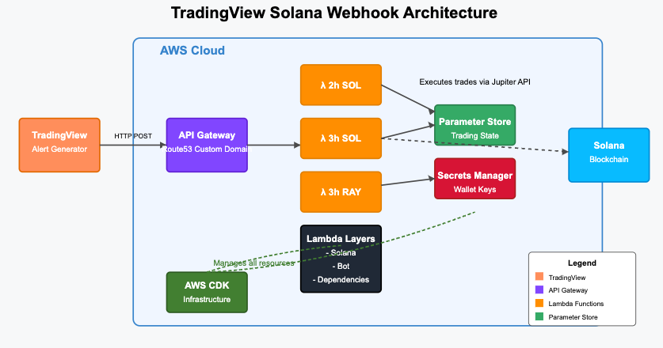
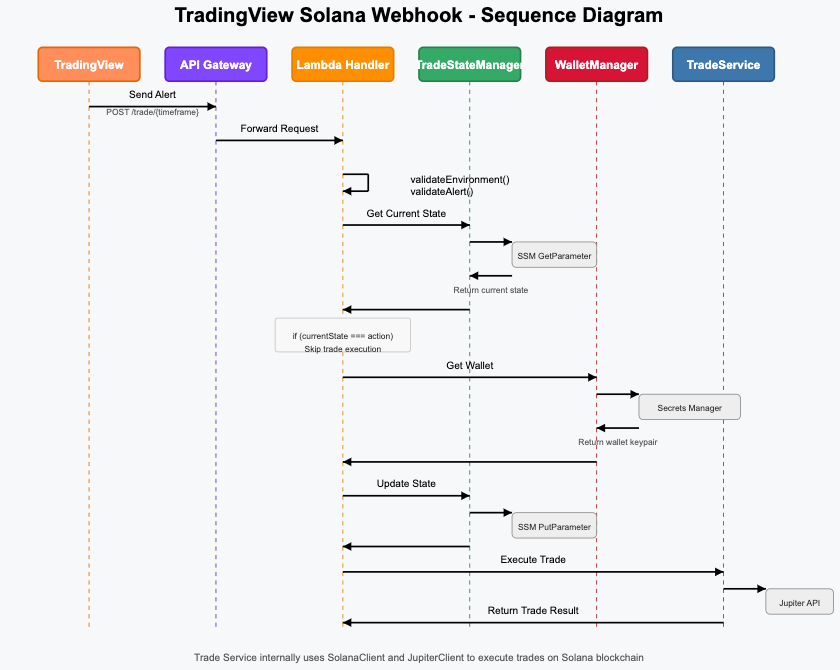

# TradingView Solana Webhook

Handles the business end of a TradingView model. Supports swapping assets using the Jupiter API.

## Architecture

TradingView will send an alert to the API endpoint. The alert is based upon the model in use and can vary.



An API is exposed that support a Trading Pair (say SOLUSDC) and a time interval. In the diagram 2h SOL indicates a handler that support a 2 hour time interval and swaps between SOL and USDC based on the alert (BUY, SELL). The model is beyond the scope of this work.

Lambda's handle the alert and make the trade, provided conditions are met. Lambda's do leverage a TradeService, which subsequently leverages a JupiterClient and SolanaClient to create swap instructions and execute the transaction, respectively. TradeService implements retry logic and manages the flow.

This flow is outlined below.



### Message format

The basic message format to construct your own alerts is below:

```
{"action": "BUY", "time": "3h", "from": "USDC", "to": "RAY" }
```

In this case, the action BUY indicates that the TradeServices should swap between USDC to RAY. The action is stored to avoid handling multiple BUY signals. The logic there is to ensure a particular action state is only executed once.

The time is used to ensure that the alert has been send to the correct handler (handlers have their own wallets).

### Prerequisites

1. AWS Account
2. Local AWS environment established

## Quick Start

1. Install dependencies `npm i`
2. Build it `npm run build`
3. Test it ... unit tests `npm run test`
4. Prep for deploy (validate deployment) `npm run synth`
5. Deploy `npm run deploy`

Note: Expects env variable AWS_DEFAULT_PROFILE to be set to the profile in which to use for deployment.

## Tests

### Unit Tests

Leverages mocks to test functionality. Unit tests live in `test/unit`.

```
npm run test
```

### Live Tests

> [!CAUTION]
> These tests, if properly configured, will execute live transactions against your assets.

Configuration of the live tests occurs in directory `test/live`. Copy `env.live.example` to `.env.live` and add appropriate info.

To run the live tests.

```
npm run test:live
```

### Run All Tests

```
npm run test:all
```

## CICD with CDK

### Customizing your environment

Edit the lib/config/.env to customize URLs and your IP. The IP is used to filter who can call your endpoint. Your IP plus TradingView's IPs.

Supports exposing the api using custom domains via Route53.

```
PUBLIC_IP=YOUR_IP_HERE
SOLANA_RPC_URL=https://api.mainnet-beta.solana.com
JUPITER_API_URL=https://api.jup.ag
DOMAIN_NAME=YOUR_DOMAIN_NAME
SUBDOMAIN_NAME=SUBDOMAIN #SUBDOMAIN.YOUR_DOMAIN_NAME
HOSTED_ZONE_ID=YOUR_HOSTED_ZONEID
```

### Bootstrap

```
cdk bootstrap aws://{aws account}/{aws region} --toolkit-stack-name {custom name} --qualifier {custom qualifier} --profile {aws profile}
```

Add the custom qualifier to cdk.json

```
 "@aws-cdk/core:bootstrapQualifier": "tviewhook",
```

### Synth

> [!IMPORTANT]
> Docker should be running.

```
cdk synth --profile {aws profile}
```

### Deploy

> [!IMPORTANT]
> Docker should be running.

```
cdk deploy --all --profile {aws profile} --require-approval never
```

## ❤️ Like this Project

Maintaining and improving this project takes time and effort. If you find it useful and would like to support its development, consider sending a donation. Hopefully, your TradingView model is profitable!

### 💸 Donate via Solana (SOL)

Send SOL donations to the following address: EuMmg13a2Vi7LPh64mwkRGsoPtYEUnAkyCwa7oYmsx58
